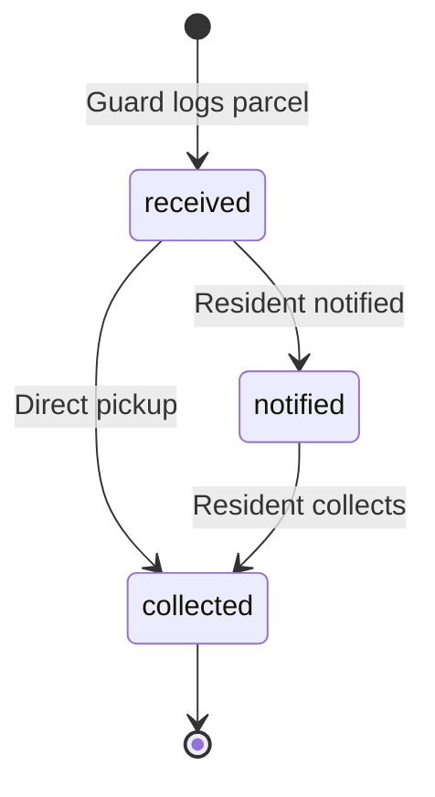
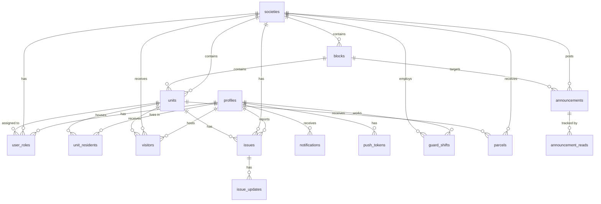

# GATED Database Schema Reference

**Project:** gatted  
**Project ID:** `wpctlkkekiarvoixasia`  
**Region:** `ap-southeast-2`  
**Status:** ✅ ACTIVE_HEALTHY  
**Database Version:** PostgreSQL 17.6.1.063  
**Generated:** January 15, 2026  
**Source:** Live Supabase MCP Metadata

---

## 📊 Schema Overview

| Category | Count |
|----------|-------|
| Tables | 14 |
| RLS Policies | 72 |
| Custom Enums | 7 |
| Functions | 11 |
| Triggers | 10 |
| Indexes | 45+ |
| Migrations Applied | 26 |

---

## ⚠️ Security Advisors

> [!TIP]
> **✅ Function Search Paths Fixed**
> All 11 public functions now have explicit `search_path = public` set, preventing schema injection attacks.

> [!TIP]
> **✅ Insecure RLS Policy Removed**
> The `temp_allow_all_inserts` policy on `announcements` table has been removed. Proper INSERT policies exist.

> [!NOTE]
> **Leaked Password Protection Disabled**
> Enable in Auth settings to check passwords against HaveIBeenPwned.org.

---

## 🗂️ Custom Enums

| Enum Name | Values |
|-----------|--------|
| `user_role` | `admin`, `manager`, `guard`, `resident`, `owner`, `tenant` |
| `visitor_status` | `pending`, `approved`, `checked-in`, `checked-out`, `denied` |
| `visitor_type` | `expected`, `walk-in`, `delivery`, `service`, `guest` |
| `issue_category` | `plumbing`, `electrical`, `cleaning`, `security`, `maintenance`, `parking`, `noise`, `other` |
| `issue_priority` | `low`, `medium`, `high`, `urgent` |
| `issue_status` | `open`, `in-progress`, `resolved`, `closed`, `rejected` |
| `announcement_target` | `all`, `block`, `unit`, `role` |

---

## 📚 Table of Contents

1. **Core Tables**
   - [profiles](#profiles) - User accounts
   - [societies](#societies) - Gated communities
   - [blocks](#blocks) - Building blocks
   - [units](#units) - Apartments/flats
   - [user_roles](#user_roles) - Role assignments
   - [unit_residents](#unit_residents) - Family members/tenants

2. **Feature Tables**
   - [visitors](#visitors) - Visitor management
   - [issues](#issues) - Complaints/maintenance
   - [issue_updates](#issue_updates) - Issue comments
   - [announcements](#announcements) - Society notices
   - [announcement_reads](#announcement_reads) - Read tracking
   - [parcels](#parcels) - Delivery tracking
   - [notifications](#notifications) - Push notifications
   - [push_tokens](#push_tokens) - Device tokens
   - [guard_shifts](#guard_shifts) - Shift management

---

## Core Tables

### profiles
User profile data linked to Supabase Auth (`auth.users`).

| Column | Type | Nullable | Default | Constraints |
|--------|------|----------|---------|-------------|
| `id` | uuid | NO | PK | FK → auth.users.id |
| `phone` | varchar | NO | - | UNIQUE, Regex: `^\+[1-9]\d{1,14}$` |
| `full_name` | varchar | YES | - | - |
| `email` | varchar | YES | - | Email regex validation |
| `avatar_url` | text | YES | - | - |
| `created_at` | timestamptz | YES | `now()` | - |
| `updated_at` | timestamptz | YES | `now()` | Auto-updated via trigger |

**RLS Policies (4)**
| Policy | Command | Applied To | Condition |
|--------|---------|------------|-----------|
| Access profiles | SELECT | authenticated | `id = auth.uid() OR is_admin()` |
| Public profiles are viewable by everyone | SELECT | public | `true` |
| Users can insert their own profile | INSERT | public | `id = auth.uid()` |
| Users can update own profile | UPDATE | public | `id = auth.uid()` |

**Indexes:** `profiles_pkey`, `profiles_phone_key`, `idx_profiles_phone`

---

### societies
Gated communities/housing complexes.

| Column | Type | Nullable | Default |
|--------|------|----------|---------|
| `id` | uuid | NO | `uuid_generate_v4()` |
| `name` | varchar | NO | - |
| `address` | text | YES | - |
| `city` | varchar | YES | - |
| `state` | varchar | YES | - |
| `zip_code` | varchar | YES | - |
| `total_blocks` | int4 | YES | `0` |
| `total_units` | int4 | YES | `0` |
| `settings` | jsonb | YES | - |
| `logo_url` | text | YES | - |
| `created_at` | timestamptz | YES | `now()` |
| `updated_at` | timestamptz | YES | `now()` |

**RLS Policies (4)**
| Policy | Command | Applied To | Condition |
|--------|---------|------------|-----------|
| Admins can manage societies | ALL | public | `is_admin()` |
| Anyone can read societies | SELECT | public | `true` |
| Authenticated users can read societies | SELECT | authenticated | `true` |
| Users can read their societies | SELECT | public | Society via `user_roles` |

**Indexes:** `societies_pkey`

---

### blocks
Building blocks within a society.

| Column | Type | Nullable | Default |
|--------|------|----------|---------|
| `id` | uuid | NO | `uuid_generate_v4()` |
| `society_id` | uuid | YES | FK → societies |
| `name` | varchar | NO | - |
| `manager_id` | uuid | YES | FK → profiles |
| `total_floors` | int4 | YES | - |
| `total_units` | int4 | YES | - |
| `created_at` | timestamptz | YES | `now()` |
| `updated_at` | timestamptz | YES | `now()` |

**RLS Policies (2)**
| Policy | Command | Applied To | Condition |
|--------|---------|------------|-----------|
| Anyone can read blocks | SELECT | public | `true` |
| Users can read society blocks | SELECT | public | Via `user_roles` society match |

**Indexes:** `blocks_pkey`, `blocks_society_name_unique`, `idx_blocks_society`

---

### units
Residential units/apartments within blocks.

| Column | Type | Nullable | Default |
|--------|------|----------|---------|
| `id` | uuid | NO | `uuid_generate_v4()` |
| `society_id` | uuid | YES | FK → societies |
| `block_id` | uuid | YES | FK → blocks |
| `owner_id` | uuid | YES | FK → profiles |
| `unit_number` | varchar | NO | - |
| `floor` | int4 | YES | - |
| `area_sqft` | numeric | YES | - |
| `unit_type` | varchar | YES | - |
| `created_at` | timestamptz | YES | `now()` |
| `updated_at` | timestamptz | YES | `now()` |

**RLS Policies (5)**
| Policy | Command | Applied To | Condition |
|--------|---------|------------|-----------|
| Admins can manage units | ALL | public | `is_admin()` |
| Anyone can read units | SELECT | public | `true` |
| Authenticated users can read units | SELECT | authenticated | `true` |
| Users can read society units | SELECT | public | Via `user_roles` |
| Users can read units in their society | SELECT | public | Via `user_roles` |

**Indexes:** `units_pkey`, `units_society_block_number_unique`, `idx_units_block`, `idx_units_owner`, `idx_units_society`

---

### user_roles
Maps users to societies/units with role assignments.

| Column | Type | Nullable | Default |
|--------|------|----------|---------|
| `id` | uuid | NO | `uuid_generate_v4()` |
| `user_id` | uuid | NO | FK → profiles |
| `society_id` | uuid | NO | FK → societies |
| `unit_id` | uuid | YES | FK → units |
| `role` | user_role | NO | - |
| `is_active` | bool | YES | `true` |
| `assigned_by` | uuid | YES | FK → profiles |
| `created_at` | timestamptz | YES | `now()` |
| `updated_at` | timestamptz | YES | `now()` |

**RLS Policies (5)**
| Policy | Command | Applied To | Condition |
|--------|---------|------------|-----------|
| Access user_roles | SELECT | authenticated | `user_id = auth.uid()` |
| Admins can insert user_roles | INSERT | authenticated | `is_admin()` |
| Admins can update user_roles | UPDATE | authenticated | `is_admin()` |
| Users can insert own roles | INSERT | public | `user_id = auth.uid()` |
| Users can update own roles | UPDATE | public | `user_id = auth.uid()` |

**Indexes:** `user_roles_pkey`, `user_roles_user_id_society_id_role_key` (unique), `idx_user_roles_society`, `idx_user_roles_user`

---

### unit_residents
Maps family members and tenants to units. *(API access granted to `authenticated` role)*

| Column | Type | Nullable | Default |
|--------|------|----------|---------|
| `id` | uuid | NO | `uuid_generate_v4()` |
| `unit_id` | uuid | NO | FK → units |
| `user_id` | uuid | NO | FK → profiles |
| `resident_type` | varchar | YES | `'family'` |
| `is_primary` | bool | YES | `false` |
| `move_in_date` | date | YES | `CURRENT_DATE` |
| `move_out_date` | date | YES | - |
| `created_at` | timestamptz | YES | `now()` |

**RLS Policies (4)**
| Policy | Command | Applied To | Condition |
|--------|---------|------------|-----------|
| residents_update_own_record | UPDATE | public | `user_id = auth.uid()` |
| residents_view_own_record | SELECT | public | `user_id = auth.uid()` |
| staff_manage_residents | ALL | authenticated | Manager/Admin check |
| users_view_society_residents | SELECT | authenticated | Society match via `user_roles` |

---

## Feature Tables

### visitors
Visitor tracking and gate pass management.

| Column | Type | Nullable | Default |
|--------|------|----------|---------|
| `id` | uuid | NO | `uuid_generate_v4()` |
| `society_id` | uuid | NO | FK → societies |
| `unit_id` | uuid | YES | FK → units |
| `host_id` | uuid | NO | FK → profiles |
| `visitor_name` | varchar | NO | - |
| `visitor_phone` | varchar | YES | - |
| `visitor_email` | varchar | YES | - |
| `vehicle_number` | varchar | YES | - |
| `visitor_type` | visitor_type | YES | `'expected'` |
| `status` | visitor_status | NO | `'pending'` |
| `expected_date` | date | YES | - |
| `expected_time` | time | YES | - |
| `purpose` | text | YES | - |
| `otp` | varchar(6) | YES | Auto-generated |
| `otp_expires_at` | timestamptz | YES | - |
| `qr_code` | text | YES | - |
| `checked_in_at` | timestamptz | YES | - |
| `checked_out_at` | timestamptz | YES | - |
| `checked_in_by` | uuid | YES | FK → profiles |
| `checked_out_by` | uuid | YES | FK → profiles |
| `check_in_photo_url` | text | YES | - |
| `is_recurring` | bool | YES | `false` |
| `recurrence_pattern` | varchar | YES | - |
| `recurring_type` | varchar | YES | - |
| `valid_until` | date | YES | - |
| `visitor_count` | int4 | YES | `1` |
| `rejection_reason` | text | YES | - |
| `created_at` | timestamptz | YES | `now()` |
| `updated_at` | timestamptz | YES | `now()` |

**RLS Policies (9)**
| Policy | Command | Applied To | Condition |
|--------|---------|------------|-----------|
| Guards can create walkin visitors | INSERT | public | Guard role + society match |
| Residents can create visitors | INSERT | public | `host_id = auth.uid()` |
| Staff insert visitors | INSERT | public | Staff role |
| Guards can view visitors | SELECT | public | Guard/Manager/Admin role |
| Residents can view own visitors | SELECT | public | `host_id = auth.uid()` |
| Guards can update visitors | UPDATE | public | Guard role + society match |
| Residents can update own visitors | UPDATE | public | `host_id = auth.uid()` + status check |
| Staff can update society visitors | UPDATE | public | Staff role + society match |
| Users can delete own visitors | DELETE | public | `host_id = auth.uid()` |

**Indexes:** `visitors_pkey`, `idx_visitors_society`, `idx_visitors_host`, `idx_visitors_unit`, `idx_visitors_status`, `idx_visitors_expected_date`, `idx_visitors_society_date`, `idx_visitors_active_lookup`, `idx_visitors_name_search` (GIN text search)

**Triggers:**
- `generate_otp_on_insert` → BEFORE INSERT → `generate_visitor_otp()`
- `visitor_status_notification` → AFTER UPDATE → `notify_visitor_status_change()`
- `update_visitors_updated_at` → BEFORE UPDATE → `update_updated_at_column()`

---

### issues
Maintenance requests and complaints.

| Column | Type | Nullable | Default |
|--------|------|----------|---------|
| `id` | uuid | NO | `uuid_generate_v4()` |
| `society_id` | uuid | YES | FK → societies |
| `unit_id` | uuid | YES | FK → units |
| `reported_by` | uuid | YES | FK → profiles |
| `assigned_to` | uuid | YES | FK → profiles |
| `title` | varchar | NO | - |
| `description` | text | YES | - |
| `category` | issue_category | NO | - |
| `priority` | issue_priority | NO | `'medium'` |
| `status` | issue_status | NO | `'open'` |
| `photos` | text[] | YES | - |
| `created_at` | timestamptz | YES | `now()` |
| `updated_at` | timestamptz | YES | `now()` |

**RLS Policies (4)**
| Policy | Command | Applied To | Condition |
|--------|---------|------------|-----------|
| Staff can update issues | UPDATE | public | Manager/Admin role |
| Users can create issues | INSERT | public | `reported_by = auth.uid()` |
| Users can read own issues | SELECT | public | `reported_by = auth.uid()` |
| Users can view their society issues | SELECT | public | Via `user_roles` |

**Triggers:**
- `issue_notification` → AFTER UPDATE → `notify_issue_changes()`
- `update_issues_updated_at` → BEFORE UPDATE → `update_updated_at_column()`

---

### issue_updates
Issue comments and status updates. *(API access granted to `authenticated` role)*

| Column | Type | Nullable | Default |
|--------|------|----------|---------|
| `id` | uuid | NO | `uuid_generate_v4()` |
| `issue_id` | uuid | NO | FK → issues |
| `user_id` | uuid | NO | FK → profiles |
| `comment` | text | YES | - |
| `new_status` | issue_status | YES | - |
| `photos` | text[] | YES | - |
| `created_at` | timestamptz | YES | `now()` |

---

### announcements
Society-wide or targeted notifications.

| Column | Type | Nullable | Default |
|--------|------|----------|---------|
| `id` | uuid | NO | `uuid_generate_v4()` |
| `society_id` | uuid | YES | FK → societies |
| `created_by` | uuid | YES | FK → profiles |
| `title` | varchar | NO | - |
| `message` | text | NO | - |
| `attachments` | text[] | YES | - |
| `target_type` | announcement_target | YES | `'all'` |
| `target_block_id` | uuid | YES | FK → blocks |
| `target_unit_id` | uuid | YES | FK → units |
| `priority` | varchar | YES | `'normal'` |
| `is_active` | bool | YES | `true` |
| `expires_at` | timestamptz | YES | - |
| `created_at` | timestamptz | YES | `now()` |
| `updated_at` | timestamptz | YES | `now()` |

**RLS Policies (5)** ✅ Secure
| Policy | Command | Applied To | Condition |
|--------|---------|------------|-----------|
| Staff can create announcements | INSERT | public | Manager/Guard role + society match |
| insert_announcements | INSERT | public | Manager/Admin role + society match |
| delete_announcements | DELETE | public | Manager/Admin role + society match |
| update_announcements | UPDATE | public | Manager/Admin role + society match |
| view_announcements | SELECT | public | User's society via `user_roles` |

**Indexes:** `announcements_pkey`, `idx_announcements_society`, `idx_announcements_active`, `idx_announcements_society_active`

---

### announcement_reads
Tracks which users have read announcements.

| Column | Type | Nullable | Default |
|--------|------|----------|---------|
| `id` | uuid | NO | `uuid_generate_v4()` |
| `announcement_id` | uuid | YES | FK → announcements |
| `user_id` | uuid | YES | FK → profiles |
| `read_at` | timestamptz | YES | `now()` |

**Indexes:** `announcement_reads_pkey`, `announcement_reads_announcement_id_user_id_key` (unique), `idx_announcement_reads_announcement`, `idx_announcement_reads_user`

---

### parcels
Delivery/package tracking.

| Column | Type | Nullable | Default |
|--------|------|----------|---------|
| `id` | uuid | NO | `gen_random_uuid()` |
| `society_id` | uuid | NO | FK → societies |
| `unit_id` | uuid | NO | FK → units |
| `resident_id` | uuid | YES | FK → profiles |
| `courier_name` | varchar | YES | - |
| `tracking_number` | varchar | YES | - |
| `description` | text | YES | - |
| `status` | varchar | NO | `'received'` | CHECK: received/notified/collected |
| `received_by` | uuid | YES | FK → profiles |
| `collected_by` | uuid | YES | FK → profiles |
| `collected_at` | timestamptz | YES | - |
| `photo_url` | text | YES | - |
| `notes` | text | YES | - |
| `created_at` | timestamptz | NO | `now()` |
| `updated_at` | timestamptz | NO | `now()` |

**Status Lifecycle:**

**RLS Policies (4)**
| Policy | Command | Applied To | Condition |
|--------|---------|------------|-----------|
| Guards can insert parcels | INSERT | public | Guard/Manager/Admin role, status='received' |
| Guards can select parcels | SELECT | public | Staff role + society match |
| Guards can update parcels | UPDATE | public | Staff role, valid status transitions |
| Residents can select parcels | SELECT | public | `resident_id = auth.uid()` or unit ownership |

**Triggers:**
- `parcel_notification` → AFTER INSERT → `notify_parcel_received()`

---

### notifications
System notification storage.

| Column | Type | Nullable | Default |
|--------|------|----------|---------|
| `id` | uuid | NO | `gen_random_uuid()` |
| `user_id` | uuid | NO | FK → profiles |
| `title` | text | NO | - |
| `message` | text | NO | - |
| `type` | text | NO | - |
| `read` | bool | NO | `false` |
| `metadata` | jsonb | YES | `'{}'` |
| `society_id` | uuid | YES | FK → societies |
| `expires_at` | timestamptz | YES | - |
| `created_at` | timestamptz | NO | `now()` |
| `updated_at` | timestamptz | NO | `now()` |

**Notification Types:** `visitor_checkin`, `visitor_checkout`, `visitor_denied`, `issue_update`, `parcel_received`, `announcement`, `alert`, `system`

**RLS Policies (4)** ✅ Secure
| Policy | Command | Applied To | Condition |
|--------|---------|------------|-----------|
| users_delete_own_notifications | DELETE | public | `user_id = auth.uid()` |
| system_insert_notifications | INSERT | public | `user_id = auth.uid()` OR Guard/Manager/Admin role |
| users_select_own_notifications | SELECT | public | `user_id = auth.uid()` |
| users_update_own_notifications | UPDATE | public | `user_id = auth.uid()` |

**Indexes:** `notifications_pkey`, `idx_notifications_user`, `idx_notifications_unread`, `idx_notifications_society_user`

---

### push_tokens
Mobile device push notification tokens.

| Column | Type | Nullable | Default |
|--------|------|----------|---------|
| `id` | uuid | NO | `gen_random_uuid()` |
| `user_id` | uuid | NO | FK → profiles |
| `token` | text | NO | - |
| `platform` | text | NO | - | CHECK: ios/android/web |
| `is_active` | bool | YES | `true` |
| `created_at` | timestamptz | YES | `now()` |
| `updated_at` | timestamptz | YES | `now()` |

**RLS Policies (1)**
| Policy | Command | Applied To | Condition |
|--------|---------|------------|-----------|
| Users can manage own tokens | ALL | public | `user_id = auth.uid()` |

---

### guard_shifts
Guard shift management. *(API access granted to `authenticated` role)*

| Column | Type | Nullable | Default |
|--------|------|----------|---------|
| `id` | uuid | NO | `uuid_generate_v4()` |
| `society_id` | uuid | YES | FK → societies |
| `guard_id` | uuid | YES | FK → profiles |
| `shift_start` | timestamptz | NO | - |
| `shift_end` | timestamptz | YES | - |
| `handover_notes` | text | YES | - |
| `handed_over_to` | uuid | YES | FK → profiles |
| `created_at` | timestamptz | YES | `now()` |

---

## 🔧 Database Functions

| Function | Returns | Security | Purpose |
|----------|---------|----------|---------|
| `checkin_visitor(visitor_uuid)` | jsonb | DEFINER | Check in a visitor with validation |
| `checkout_visitor(visitor_uuid)` | jsonb | DEFINER | Check out a visitor |
| `cleanup_expired_visitors()` | void | INVOKER | Mark expired visitors as denied |
| `generate_visitor_otp()` | trigger | INVOKER | Auto-generate 6-digit OTP |
| `get_user_context()` | record | DEFINER | Get current user's roles/societies |
| `get_user_context(user_uuid)` | record | DEFINER | Get specific user's context |
| `is_admin()` | boolean | DEFINER | Check if current user is admin |
| `notify_issue_changes()` | trigger | DEFINER | Create notification on issue update |
| `notify_parcel_received()` | trigger | DEFINER | Notify resident of new parcel |
| `notify_visitor_status_change()` | trigger | DEFINER | Notify on visitor status change |
| `update_updated_at_column()` | trigger | INVOKER | Auto-update updated_at timestamp |

---

## 🔗 Entity Relationship Diagram

---

## 📋 Migration History

| Version | Name | Applied |
|---------|------|---------|
| 20260110090409 | fix_visitors_rls_policies | ✅ |
| 20260110090413 | fix_issues_rls_policies | ✅ |
| 20260110205042 | fix_user_roles_rls | ✅ |
| 20260110205253 | fix_societies_rls | ✅ |
| 20260110205621 | fix_units_rls | ✅ |
| 20260111061743 | fix_visitors_rls | ✅ |
| 20260111083153 | add_blocks_rls_policy | ✅ |
| 20260111095122 | add_parcels_table | ✅ |
| 20260111100226 | allow_guards_insert_announcements | ✅ |
| 20260111101628 | fix_parcels_rls_policies | ✅ |
| 20260111102206 | grant_parcels_permissions | ✅ |
| 20260111104325 | create_parcels_table | ✅ |
| 20260111104330 | create_issue_photos_bucket | ✅ |
| 20260111110351 | create_notifications_table | ✅ |
| 20260111113821 | fix_rls_part_1_core | ✅ |
| 20260111113849 | fix_rls_part_2_visitors_announcements | ✅ |
| 20260111113946 | fix_rls_part_3_retry | ✅ |
| 20260111114240 | fix_user_roles_infinite_recursion | ✅ |
| 20260111114559 | fix_infinite_recursion_rls | ✅ |
| 20260112120806 | cleanup_duplicate_rls_policies | ✅ |
| 20260112134711 | add_notifications_metadata_column | ✅ |
| 20260112192417 | fix_rls_security_issues | ✅ |
| 20260113212700 | fix_critical_security_issues | ✅ |
| 20260113212755 | fix_remaining_function_search_paths | ✅ |
| 20260113213307 | cleanup_rls_policies | ✅ |
| 20260113213339 | cleanup_remaining_visitor_duplicates | ✅ |

---

## 🔌 Installed Extensions

| Extension | Version | Schema | Purpose |
|-----------|---------|--------|---------|
| `pgcrypto` | 1.3 | extensions | Cryptographic functions |
| `uuid-ossp` | 1.1 | extensions | UUID generation |
| `plpgsql` | 1.0 | pg_catalog | PL/pgSQL procedural language |

---

*Generated by Supabase MCP Analysis • January 14, 2026*